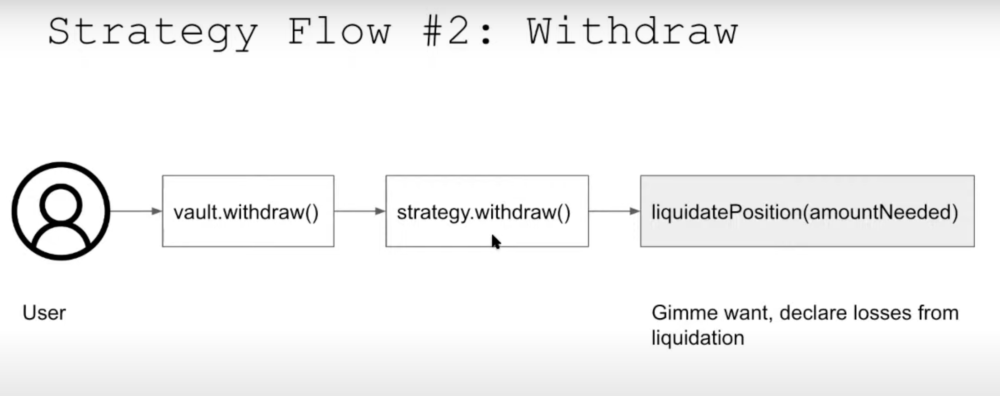

# 🏗 scaffold-eth | 🏰 BuidlGuidl

## 🚩 **Challenge X: Yearn Strategy General Info**

This challenge is focused on guiding students through the following:

- What a Yearn Strategy is
- The typical ins and outs of a Yearn strategy to be aware of that Yearn v2 Vaults take with their actual strategies
- The approach taken to writing this yearn strategy (how @steve0xp got into writing this yearn strategy where he is focused on getting it to ape.tax)
- Writing this yearn strategy and getting experience dealing with some types of intricacies that come up when writing yearn strategies, and strategies in general

### DeFi Sub-Branch Context

This challenge is part of the DeFi Sub-Branch, where students are invited into writing smart contracts that incorporate actual DeFi protocols. The sub-branch projects are ever-expanding as DeFi is too. The goal of the Defi sub-branch projects/tutorials are to provide students tutorials that foster self-learning in actual DeFi protocols, guide you through some of the basics of integrating with specific protocols, and other useful tips to increase competence to be potentially hireable as an intermediate developer. 

Teams are looking for developers with **real** experience; mainnet/real contracts deployed, battle tested, TVL locked in, audited, etc. These tutorials won't give you smart contracts to deploy and test outright as your own, but give you the framework for possible starting points for your own ideas! Be original 😉

**Students taking on this challenge will be expected to embrace self-learning** since tying into DeFi protocols and actual professional crypto projects do not guide developers, step-by-step. If you are new to trying to actually plug into a professional project, no worries! We'll touch on some helpful tips as you sort out what the 'norm' is when going through this process. These tips will be specific to each protocol that we are integrating into and learning about.

### Steps taken when Starting this Yearn Strategy Itself
A typical professional crypto project will have developer docs to help onboard devs into the respective tech stack. The approach that was taken when writing this yearn strategy was to read through the docs, and jump in to the communication channels offered from the protocol. IN this case it was the Yearn Discord && [Yearn General Telegram Group Chat](https://t.me/yearnfinance) && eventual the gated Telegram group chat, YFI Boarding School.

**@steve0xp wrote threads outlining his journey writing this Yearn Strategy, we heavily recommend checking out the respective thread highlighted through different parts of this tutorial.** We'll list them out all here now though for easier reference. These offer a general landscape of this tutorial's contents. We will use his journey && strategy as the basis of this tutorial.

**DRAFT THREADS - TODO: finalize these links once the threads are posted.**

1. [Getting started, conceptualization && initialization](https://typefully.com/t/X7kgQ4J)
2. [Troubleshooting with other devs && discussions](https://typefully.com/t/7viHbCb)
3. [Q/C through writing unit tests](tbd)
4. [Deployment && getting actual dollars into the strategy from yearn vaults](tbd)

## Yearn Strategy Intro Challenge

This is the first part of 2 challenges focused on writing Yearn strategies.

1. First challenge - create a super simple strategy to get used to the ins and outs of the `harvest` tx flow.
2. Second challenge - create a strategy atop of Mellow Protocol && Gearbox Protocol w/ tests!

### Simple Yearn Strategy

To kick things off, we'll start by going over the yearn strategy tutorial that Yearn core dev, @cdalton, has gone over in this video. Here he covers making a yearn strategy where we pull DAI from the DAIVault in Yearn and deploy it in a lending pool in Compound. If you're not familiar with Compound, they are an OG lending protocol where users can be lenders and borrowers of whitelisted tokens (deemed legitimate through Compound governance).

This tutorial goes over:

- Building a strategy using foundry testing framework
- Video touches on testing with foundry a bit


- For each yVault there are multiple strategies. Example in the above image: DAI is distributed to different strategies where certain amounts have allocations to it.

**Accounting VIP Details**
It's key to know that the strategies take on `debt` from the vaults. AKA some amount of DAI is given to the strategy from the vault. So the strategies below would have some `debt` w/ specified amounts.

Let's touch on the strategy flows:

**Strategy Flow #1**

_Don't worry about the bots, we use OP, a template pattern that extends from the template_

`harvest()` is called by a `keep3r` which does the following:
- `prepareReturn(debtOutstanding)` : decelaring accounting losses and gains since the last harvest. `debtOutstanding` is the amount of wantToken that the vault wants back. So within `prepareReturn()` there will be internal calls to liquidate, if needed, some wantToken to obtain the requested amount of `debt` back to the vault from the respective strategy. This is a function that exists in every strategy.
- `adjustPosition(debtOutstanding)` : the inverse of the above, investing any excess `wantToken` into the respective strategy. In this case DAI.


**Strategy Flow #2**

User withdraws from the vault which calls withdraw from the strategy. This further calls a function called `liquidatePosition(amountNeeded)`. If not enough funds then losses are declared (accounting side of things).

`withdraw()`



**Why Build with Foundry**

- 10x faster WITH fuzzing which is good for catching edge cases (rounding, etc.)
- Fuzzing
- Console.log
- Solidity so less context switching vs testing with Brownie in this case

### Diving into the code

So this is started from a foundry mix that @storming0x made [here](LINK).

The tutorial goes over the changes made that you can will implement into your challenge! *As always, solutions are made but don't peek!!!

In strategy.sol

- import OZ library
- import CDAI as a constant
   - import ICToken.sol because we are building a compound-DAI strategy.
    - CDAI will be the pool we're deploying into.

CToken interface details:

function 1: mint()
- amount of DAI is given in, and it gives you the amount of CDAI it's worth.

redeem():
- amount of CDAI that you want to burn and it gives you back however much DAI it's worth.

exchangeRateStored():
- when valuing the CDAI position we have, we multiply the CDAI position by this exchange rate and it gives the value of DAI in CDAI.

### code

We need to first approve the amount of DAI that we are putting into this CDAI pool.

```
want.approve(address(cDAI), type(uint256).max)
```